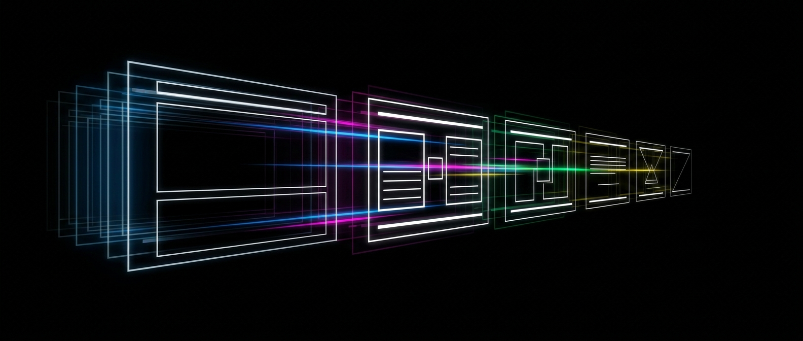
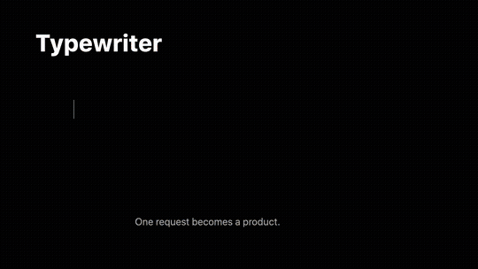

# apple-keynote-motion 🎬: Build and verify native Apple-style motion in Keynote.

<p align="center">
  
</p>

<p align="center">
  
  
  
  
</p>

`apple-keynote-motion` is a Codex skill for creating, editing, auditing, and reverse-engineering native Keynote motion. It treats slide transitions, object continuity, Build In/Action/Build Out timelines, and rendered playback as separate layers, then checks the result in Keynote. The repository includes a sanitized 21-slide native scene library with no source Apple deck or extracted Apple media.

<p align="center">
  <a href="https://github.com/kevinastuhuaman/apple-keynote-motion/releases/download/v7.0.0/apple-keynote-motion-v7-demo.mp4">
    
  </a>
  <br>
  <sub>Preview (12 seconds) · <a href="https://github.com/kevinastuhuaman/apple-keynote-motion/releases/download/v7.0.0/apple-keynote-motion-v7-demo.mp4">watch the full 60 fps demo</a></sub>
</p>

## What it does

- Creates and edits native Magic Move, Dissolve, Push, Build In, Action, and Build Out sequences.
- Recovers document order and exact native animation settings from `.key` archives.
- Models motion as transitions, continuity, build timelines, and rendered behavior.
- Exports important sequences at 1080p/60 fps and measures every decoded frame.
- Reuses a sanitized native scene library covering typewriter text, paragraph cascades, charts, motion paths, compound actions, and dense object expansion.
- Separates native observations, visual observations, inferences, and recommendations so the evidence stays honest.

## How it works

```text
Reference deck or rough slides
              │
              ▼
Recover order + native motion state
              │
              ▼
Model transitions + continuity + builds
              │
              ▼
Edit a scratch copy in native Keynote
              │
              ▼
Export 1080p/60 fps playback
              │
              ▼
Measure frames, fix the largest attention error, repeat
```

## Install

```bash
git clone https://github.com/kevinastuhuaman/apple-keynote-motion.git
mkdir -p ~/.codex/skills
rsync -a apple-keynote-motion/apple-keynote-motion/ ~/.codex/skills/apple-keynote-motion/
```

Start a new Codex task and ask it to create, edit, audit, or study motion in a Keynote deck. The bundled scene library is source material for a task copy. Do not edit the original asset in place.

Deep archive and playback analysis may also use `numpy`, `Pillow`, `keynote-parser`, `ffmpeg`, `ffprobe`, and `libsnappy`. Keynote 15.3 is the tested baseline. Automation and Accessibility permission are required for inspector controls that AppleScript does not expose.

## Evidence

- Extracted 1,131 exact native events from 118 structural scenes.
- Verified a sanitized 21-slide native scene library at 1920x1080 and constant 60 fps.
- Covered Magic Move plus typewriter text, paragraph cascades, charts, motion paths, compound Move + Scale + Opacity, transient Build Outs, and a 65-object expansion.
- Passed 87 automated tests, skill validation, AppleScript compilation, ZIP integrity checks, and the internal SHA-256 manifest.

Motion scores in this project measure explicitly defined timing or rendered-motion dimensions. They are not a claim that every generated deck is numerically "99% Apple."

## Tech stack

- **Presentation runtime:** Apple Keynote 15.3
- **Native control:** AppleScript, System Events, and macOS Accessibility
- **Archive analysis:** Python 3, `keynote-parser`, and Snappy
- **Playback analysis:** FFmpeg, NumPy, and Pillow
- **Agent runtime:** Codex skills with `SKILL.md`
- **Verification:** Native-state extraction, all-stage renders, and frame-level playback analysis

## What I learned

- Magic Move is only one layer. Many of the hardest scenes depend on Build In, Action, and Build Out choreography without a slide transition doing the work.
- Native settings and rendered playback need separate evidence. A control can be correct in the inspector while the exported sequence is still clipped, blank, or visually mistimed.
- A reusable scene library is more useful than a pile of screenshots. Native objects preserve editability, timing controls, and continuity IDs for the next deck.

## Project boundary

This repository does not distribute original Apple presentations, extracted Apple media, or the private reference-asset index used during research. The bundled Keynote scene library was sanitized and checked for exact payload overlap against the private corpus.

This is an independent experimental project. It is not affiliated with, sponsored by, or endorsed by Apple. Apple, Keynote, and related marks are trademarks of Apple Inc.

## License

MIT © 2026 Kevin Astuhuaman
